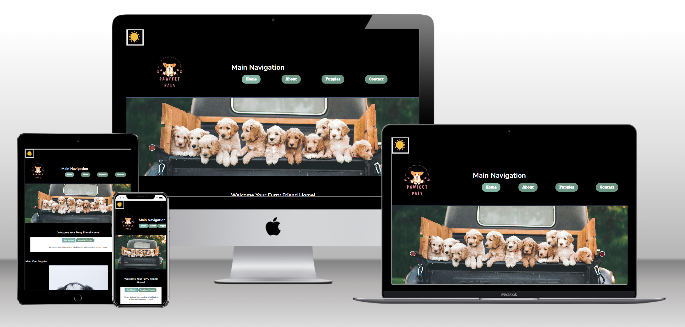

<!-- 🟡 GITHUB README FOR ERAM AHMED -->

<!-- Header Banner -->

  

<!-- Intro -->
<h1 align="center">Hi, I'm Eram Ahmed 👋</h1>
<h3 align="center">Web Designer | Front-End Developer | Motion Graphics & Video Creator</h3>

I design and build responsive, human-centered websites that balance creativity with usability.
My work blends visual design, front-end development, and motion graphics to craft interactive, engaging digital experiences.

---

### 🌍 About Me
- 🎓 **Graphic Information Technology major** passionate about web design and front-end development  
- 💻 Skilled in **HTML, CSS, JavaScript, jQuery, Bootstrap, and Adobe Creative Cloud**  
- 🎬 Experienced in **Premiere Pro, After Effects, Photoshop, and Illustrator**  
- 🎨 I enjoy blending **art, code, and storytelling** to create meaningful experiences  
- 🧭 Currently exploring: **accessibility, UI animations, and design systems**

---

### 💼 Featured Projects

#### 🐶 Pawfect Pals 

  

**Live Demo:** [Pawfect Pals](https://eahmed8.github.io/FinalAssignmentGIT418/)  
Responsive pet adoption website with playful design and interactivity.
- ✅ Built using semantic HTML, CSS Grid/Flexbox, JavaScript  
- 🌙 Includes **light/dark mode toggle**  
- 🎲 Fun features: number game + image carousel  
- 📷 Uses third-party API to display random dog images
- Optimized for accessibility and mobile viewing  

---

#### ✈️ Wunderlust Travel  

**Live Demo:** [Wunderlust Travel](https://eahmed8.github.io/wunderlust-responsive-webpage/)  
A visually immersive travel site designed to spark curiosity and exploration.  
- 🖥 Fully responsive — desktop, tablet, mobile layouts  
- 🎨 Inspired by travel blogs + editorial web design  
- ⚙️ SEO-friendly structure with descriptive meta tags  
- 🗂 Organized with Destinations, Trip Planner, Testimonials, Contact
  
---

#### 🚀 Journey to Launch  
**Watch Animation:** [Rocket Animation](https://youtu.be/Cwde-2LpVH0)  
2D motion animation of a rocket launching through the sky.  
- 🎬 Created in Adobe After Effects  
- ☁️ Used masks, blur, easing, opacity keyframes for clouds and smoke  
- ⭐ Added twinkling stars with curve + brightness animation  
- 🔥 Fire animation refined with masking + flickering glow

---

#### 🎵 Music Through My Ears  
A short cinematic video combining music, ambient sound, and visuals.  
- 🎧 Layered environmental sounds with EQ and reverb  
- 🎞 Added cinematic black bars + rolling end credits  
- 🕹 Synced transitions with beat and scene changes  
- 📤 Exported in H.264 for high-quality streaming  

---

### 🧰 Skills & Tools

#### 💻 Development

  
  
  
  
  
  
  
  
  

#### 🎨 Design & Motion

  
  
  
  
  
  
  

#### 🛠 Tools & Workflow

  
  
  
  
  

I build responsive web experiences using <b>HTML, CSS, and JavaScript</b>, and bring visuals to life through <b>Adobe Creative Cloud</b> and motion graphics. My workflow blends clean development practices with design thinking, accessibility, and user-centered storytelling.

---

### 🤝 Connect With Me

  
  
  
  

---

### 📊 GitHub Stats

  
  

---

### 🧭 Currently Exploring
- Accessibility and inclusive UI patterns  
- Interactive motion design for the web  
- Design systems and reusable components  

---

  <i>“Good designs are usable. Great designs are invisible.”</i> 
  <b>Let’s build something thoughtful together ✨</b>

---

